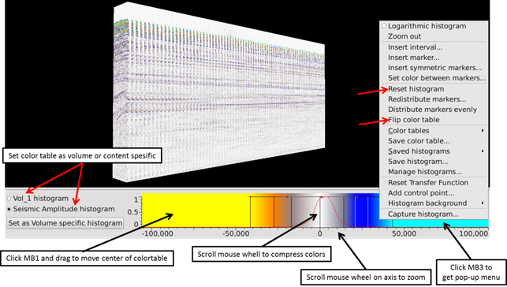
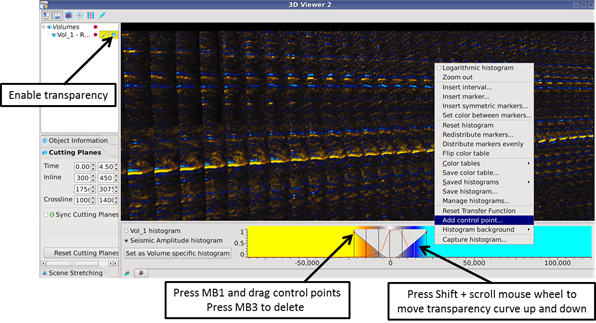

# Histogram \(Color bar\) and Transfer Function

The 3D viewer has the same histogram as you find in the 2D viewers.

_Histogram & colorbar_

## **Transfer function:**

By adding and moving control points, the ‘Transfer function’ allows the user to set transparency on a volume. It is easy to operate, just remember to enable transparency for the actual volume you want to use.

_Transfer function_

