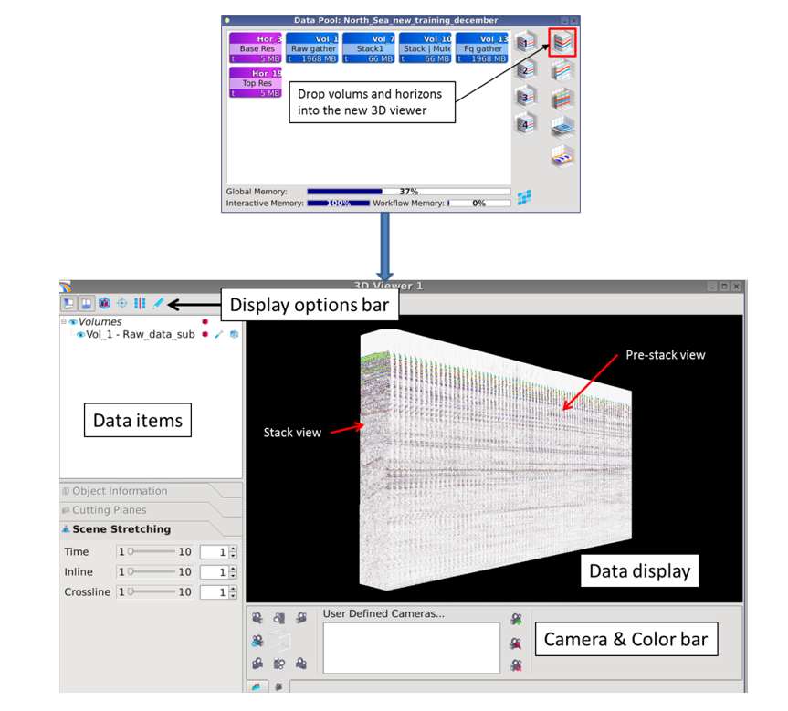

# Load and display data

Data are selected by drag and drop from the Data Pool. Drop data into the new 3D viewer icon. The viewer consists of 4 fields; Data display, Display options bar, Data items and the Camera & Color bar.

_3D viewer_

In the Data display window the items can be rotated using MB1, zoomed using MB2 \(can also scroll the mouse wheel\) and MB3 for pan.

The seismic is displayed in both stack view and pre-stack view. If gathers are displayed in inline direction, stack is shown in crossline direction \(and opposite\).

From the Display options bar you can \(1\) activate a bounding box that shows inline/crossline/time axis, \(2\) enable cursor read out mode to read out information from any position, and \(3\) flip between inline and crossline direction for showing gathers. In \(4\) you can edit axis annotation.

_Display option bar_

_Cursor read out_

In the Data items field seismic volumes and horizons can be managed. Several icons are attached to each data object.

_Adjust window size and activate data_

Click on the eye icon to hide or unhide data. Click on the ‘edit mode’ icon to enable tabs in the lower part of the window. Click on ‘enable transparency’ to activate the transfer function \(in histogram/ color bar\). All windows inside the 3D viewer can be adjusted or hidden by dragging the border lines vertically or horizontally.

_Manage volumes_

If you have loaded several volumes into the viewer, the one on the top of the list will be visible, in front. To make a volume visible, in front, right click and select ‘Move to top’ from the pop-up menu. You can also use the short cuts noted in the pop-up. In this way, you can quickly flip the view between volumes.

From the same menu, you can also set rotation center and remove the object. Set rotation center means that that the mid-point of your selected object will be the rotation center.

