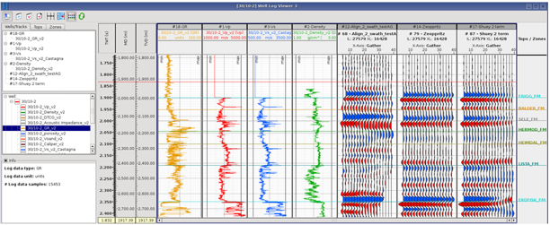
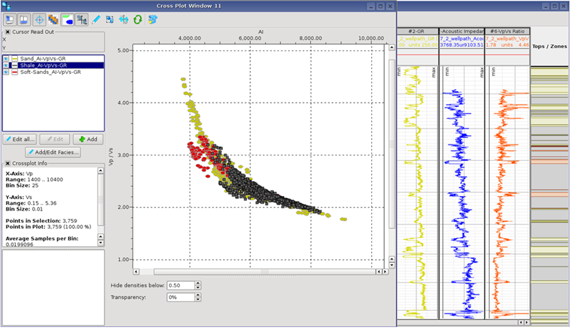

# Well log viewer

This application displays well logs, seismic gathers and stacks, and synthetic gathers.

Seismic and synthetic data are displayed as wiggle traces only. All gather traces are shown. However, for stacks, only 21 inline/xline traces will be displayed, centered around the selected X/Y location.

A reference well, gives MD / TVD / TWT scales, and tops, zones and facies for the Well Log Viewer – usually set automatically at the well from the first log displayed.

Multi-well log displays are possible within one viewer or by syncing several well log viewers. The TWT vertical scale of a Well Log Viewer and Seismic viewer can also be synced. To add a TWT scale alongside the MD/TVD scale bars use the scale-bar MB3 context menu &gt; insert TWT scale. _**Make it a linear scale by dragging it to be the first scale bar from the left.**_

Well Log Viewer allows the Q.C. and analysis of gather synthetics

• by visualization of logs and synthetics with real gathers,  
• by comparing different Vp/Vs/rho log sets and their synthetics e.g.:  
brine, oil, gas

_Well Log Viewer - showing Vp,Vs,Rho logs used for synthetic angle gather creation along with a GR log, tops, real angle gather at the well and both a zoeppritz._

Facies zone creation \(Vp/Vs/rho classes\) is enabled within the application ready for input to Pcube inversion & crossplots.

_Crossplot & Well Log Viewer - showing 3 zones defined by time range and GR value \(sand = 0 -75, shale =75-150\)_ _\(AI & Vp/Vs logs created on log import, sand and shale zones converted into Vp,Vs,rho,facies in Well Log Viewer, for display in PSPRO crossplot\)_

