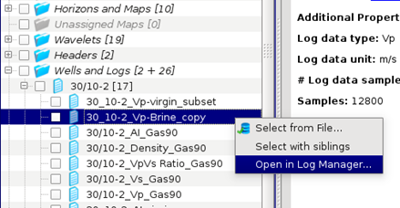
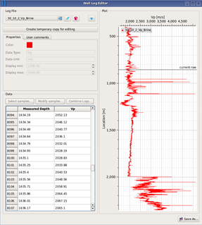
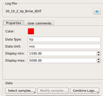
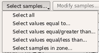
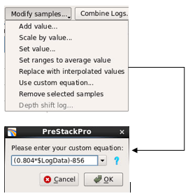
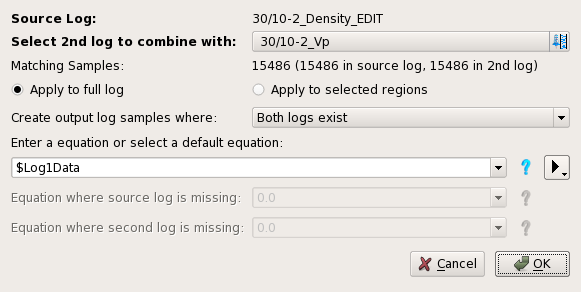
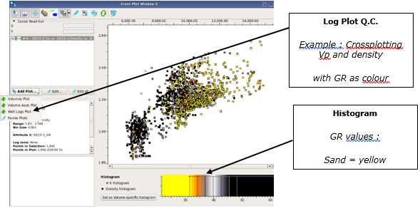

# Log data Q.C. &  management

Logs can be renamed or deleted as a group using **Project → File manager**    
  
To rename a log, double click on the log name in the tree.

A group of logs can be selected from the tree and deleted all together.

Logs can be Q.C’d by **Utilities → Edit Well Logs.** This can also be opened for a specific log within the File Manager by selecting Log Manager from the MB3 context menu.

_Opening **Well Log Editor** from the file manager tree_

_Logs can be edited by selecting **Create temporary copy for editing**. This creates an editable copy of the log. In the figure below, the upper left section of the Well Log Editor is seen in edit mode._

In edit mode, log samples can be selected and modified, and logs can be combined.

To **select samples**, choose Select samples. Several selection options are available. 

To modify samples, select one or more values in the table \( **Modify samples** button will become active\). Then select **Modify samples**. Several options are available; adding, setting and scaling by value, interpolation and removal of samples, and using custom defined equation. In the example to the right, **Use custom equation** has been selected. The syntax is the same as for Volume Calculator. Here Vp is converted to Vs, for sands, using the Castagna equation.

Select **Full Log --&gt; Simple Log Filter** to apply a Butterworth filter on a log. 

The log will be resampled, using a sample interval copied from a volume. Both low and high pass filters are also available. 

Select **Combine Logs** to merge and mask other logs with the current log

When using **Combine Logs** it is possible to specify output log range, the method for populating empty regions in one of the logs, and to specify a custom equation.

_Logs can be crossplotted for Q.C in **Interpretation-processing → Cross Plot**._

