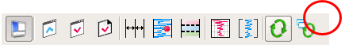
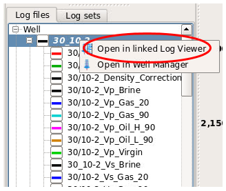
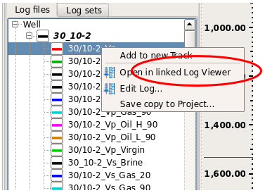

# Linked log viewer

The existing log viewer can be linked to a new log viewer by clicking the “Link with new Log viewer” icon in the toolbar.

Wells can be opened in a linked Log Viewer by selecting well, MB3 and then select “Open in linked Log Viewer”.

Well logs can be opened in a linked Log Viewer by selecting well log, MB3 and then select “Open in linked Log Viewer”.

The well log viewer and the linked well log viewer are synchronized in depth.

