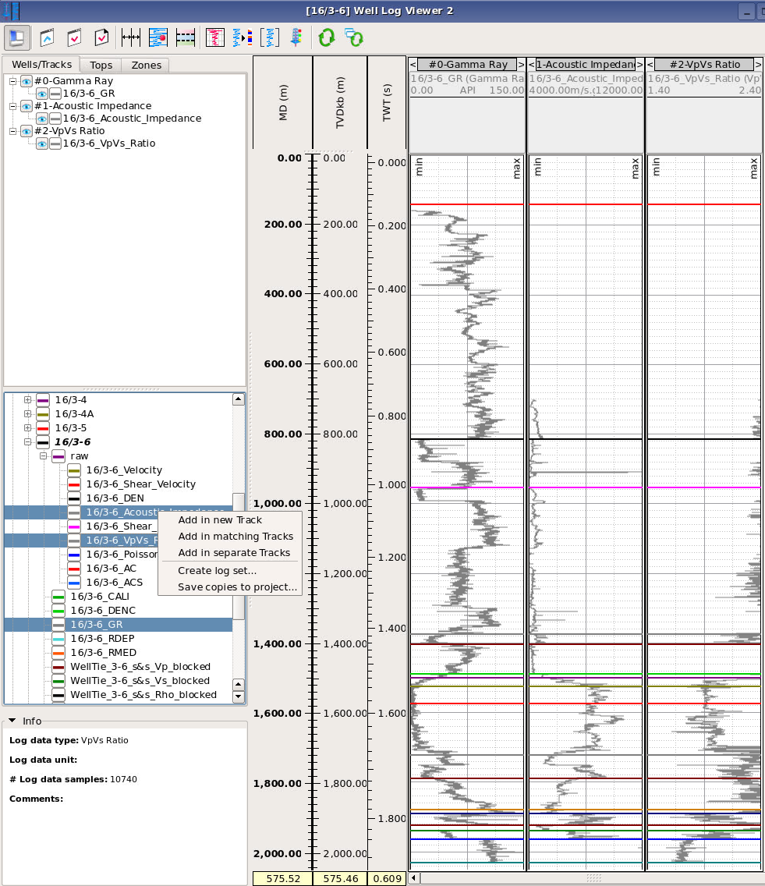
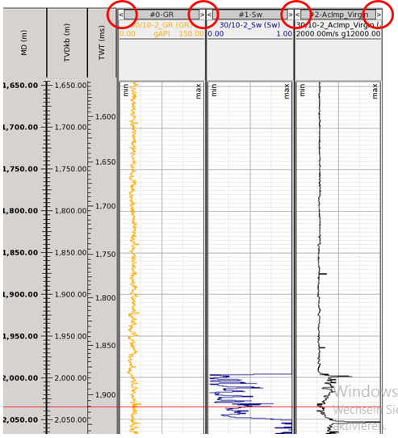
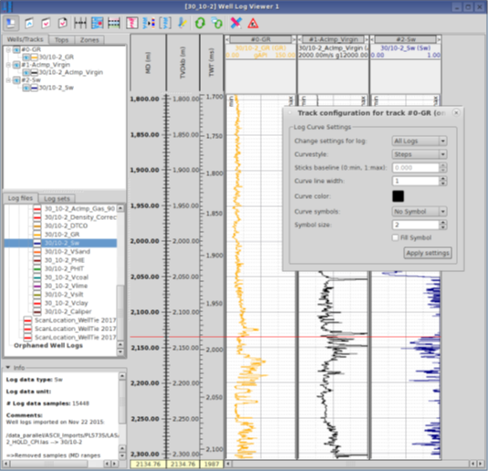
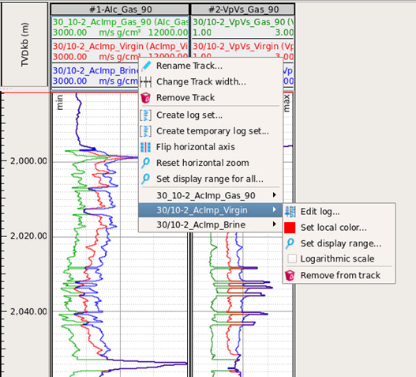
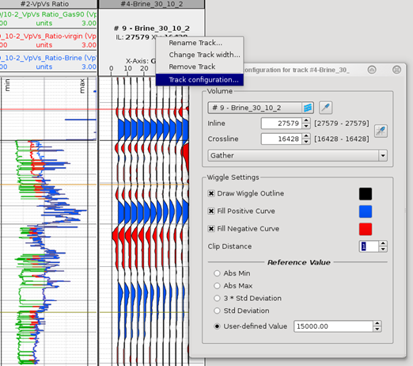

# Well Log Viewer GUI

_Well Log Viewer - showing 3 Log Tracks, from well 16/3-6. Logset "raw" defined with elastic logs. Logs selected by Ctrl+MB1, and MB3 for context menu._

There are different ways to display **Logs** in the Log Viewer

* drag and drop **single well log** from data tree \(logs displayed in defined color\)
  * into the empty part of the display area \(create a new track\)
  * log can be added to an existing track by dragging it into the track
* drag and drop **log set** from data tree into the empty part of the display area \(all logs displayed in with log set color\)
  * add in one track \(all logs in same track, with individual log color\)
  * add in separate tracks \(create one track per log in log set\)
  * add in matching tracks \(only logs matching type in tracks\)
* select **multiple well logs** \(Ctrl+MB1\) from data tree and MB3 for context menu
  * add in new track \(all logs in same track, with individual log color\)
  * add in matching tracks \(only logs matching type in tracks\)
  * add in separate tracks \(create one track per log in log set\)
  * create log set \(only apply for elastic logs\)
  * save copies of selected logs to project

Logs will be displayed using their default min-max range set per data type in settings. To change the range go to the log track header context menu \(MB3 on header\). By default, log display is not restricted to the depth of the reference well path. It is possible to enable this restriction via the axis context menu.

Tracks can be moved laterally by clicking on the arrows icon on the top of each track, or can be re-arranged in teh Well/Tracks Tab to the left by drag/drop. 

  
_Arrow buttons to re-arrange order of tracks laterally_

  
_Track configuration settings_

The **Track configuration settings** is invoked from the context menu on a track. The curve style, curve line width, color and symbols can be applied either to one or all logs.

**Track Vertical pan & zoom** is by mouse wheel and drag in log/seismic display or MD/TVD/TWT scale bars. Double click in a scale track allows manual setting of the vertical range.

**Track Horizontal pan & zoom** is by mouse wheel and drag in log/seismic track header only. Min/Max line setting, for this display, is by header MB3, context menu **Set display range...**

**Logarithmic scale** can be set by header MB3, context menu **Logarithmic scale**.

_Well Log Viewer - Log Track header, right mouse button, context menu.   
NB. When fluid-substituted logs are ordered as log sets they can easily be added to matching tracks and will display with log set color_

  
**Tops** and **Zones** can be turned on in the Log tracks, by selection in Tops or Zones Tab. New Tops can be picked using the MB3 log track data context menu. New zones, created by MB3 Zones Tab tree list, context menu.

In the Tops tab, under the list of tops there are two icons respectively to save the visible tops to the global setting display for the master well and to load and apply the settings for the master well.

**Create Zones: Add new log zone** from the Zones Tab context menu to define a log zone using a number of cascaded filters. There are 6 types to choose from the drop-down menu shown below.

1. Bounded by Well Tops
2. Define a range by cut-off values on specified log
3. Bounded by Time-Range
4. Bounded by Depth-Range
5. Bounded by Cross-Plot polygon \(polygon defined from two logs\)
6. Window around a Well Top

The **Cross plot polygon**, allows the use of a cross plot polygon to define log zones. This can be used to include/exclude points for Facies \(LFC\) estimation. It can also be used to dynamically see where log points in cross plot are in well log viewer

**Create Facies \(LFC\):** MB3 context menu on a zone name, allows **Create facies from zone...** and appropriate log sets can be selected or logs selected individually. If zone is defined in multiple wells a list of availbale wells will show and more well data can be added to the facies defintion

**Seismic** volumes from the data Pool, can be displayed in their own track, by the same drag and drop action. The default location is the wellhead inline/xline location. The seismic track header context menu allows the user to change this to any map location, using the usual pipette, manual input methods or at defined well top.

Change the amplitude reference value in the **Track configuration** window to a user defined value if you want to make subtle amplitude comparisons between datasets. The default of _"_3 Std deviation" could hide amplitude differences. It is also possible to restrict the angle range displayed in the **Track configuration** window for pre-stack volumes. The Track configuration is invoked from the context menu of a track, or by a double-clicking inside the track.

_Well Log Viewer - Seismic Track header, right mouse button, context menus_

\_\_

