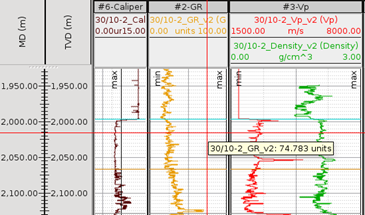
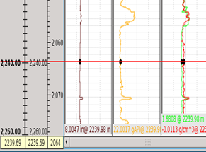
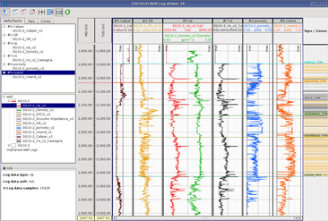
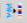
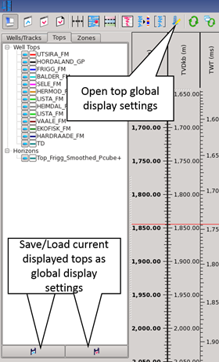

# Well Log Viewer icons

\*\*\*\*

It is possible to invoke the **Create Synthetic Gather** algorithm from the Well Log viewer via the relevant icon 

The global top display setting can be invoked from the Well Log viewer via the relevant icon. Moreover, it is possible to save the current set of displayed tops as the global display setting.

