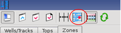
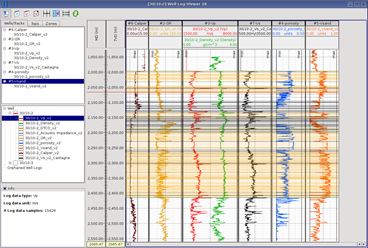
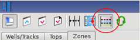
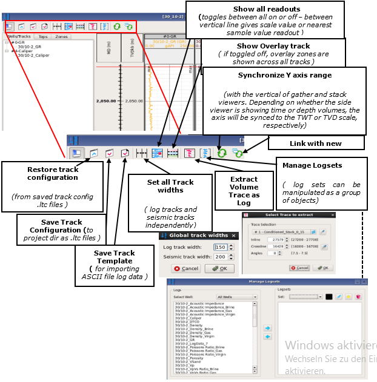

# Well Log Viewer icons

_Cursor readout = scale_

_Cursor readout = nearest sample_

_Zones displayed only in overlay track_

**Show all readouts Icon**  
All on or off & between  
• vertical line gives scale  
• value or  
• horizontal line gives  
• nearest sample values.

_Zones displayed in all log tracks_

**Zone overlay display Icon:**  swaps between all log tracks and overlay track only, displays

It is possible to invoke the **Create Synthetic Gather** algorithm from the Well Log viewer via the relevant icon 

The global top display setting can be invoked from the Well Log viewer via the relevant icon. Moreover, it is possible to save the current set of displayed tops as the global display setting.

