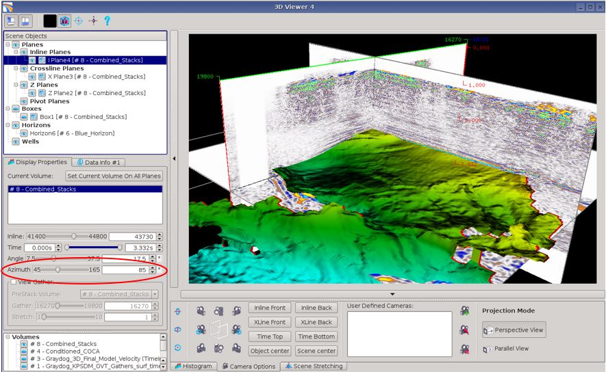

# 5D Volumes

3D viewer can now display 5D volumes such as COV, azimuth stacks, COCA and CICA gathers.  
Just by a simple drag and drop to the 3D viewers, the software will notice the different dimensions and slide bars will be added on the left panel.

Just like other volumes, the 3D viewer allows on the fly computation of attributes along horizons. Angle stacks for each azimuths can be displayed on the 3D viewers, and amplitude can be performed on the fly in the 3D viewer.

