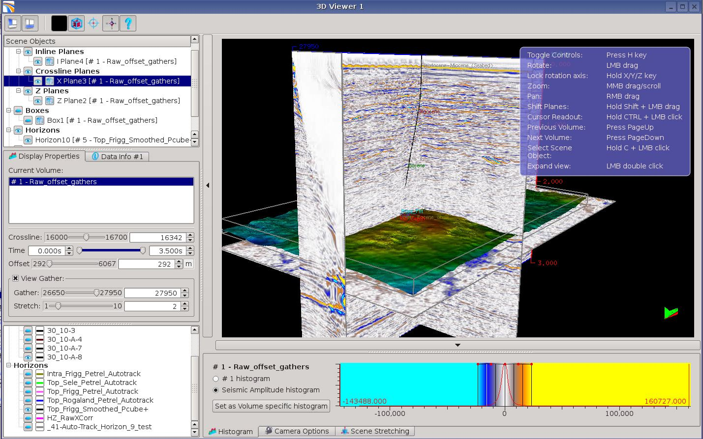
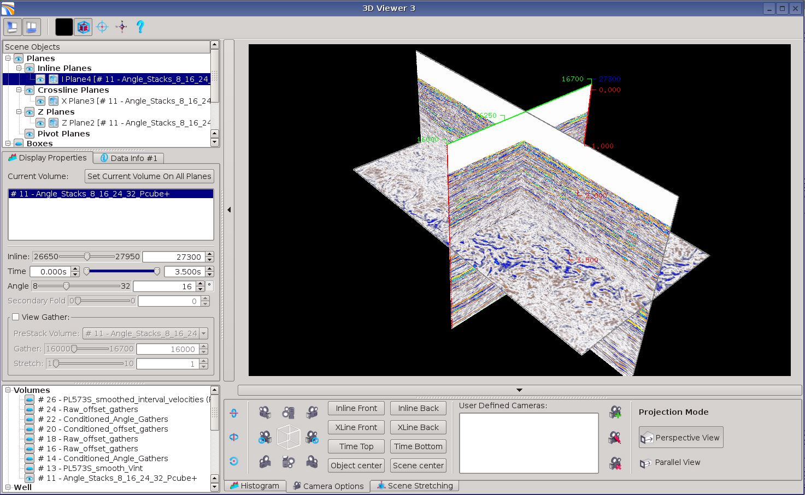
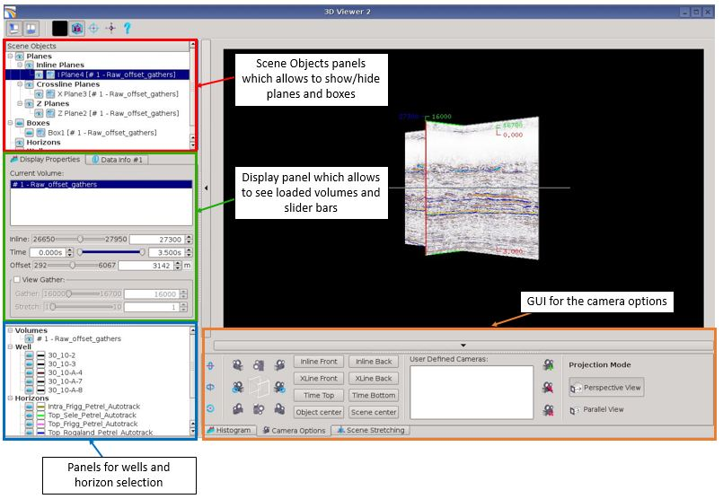
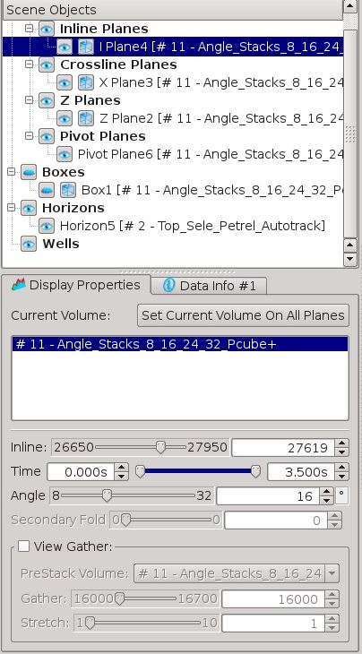
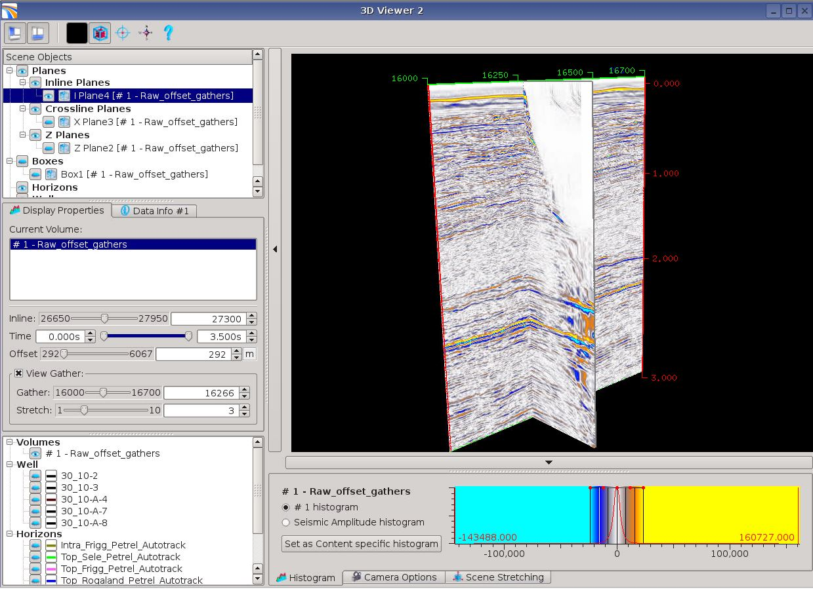

# 3D Viewer

PreStack-PRO 3D Viewer allows to display and compare simultaneously stack and pre-stack volumes. Thus, you can now look at 3D/4D/5D volumes in one 3D viewer by using real world X,Y coordinates.

This enables the viewing of seismic data in context with complex geological structures, like horizons and faults, as well as with other objects such as well paths. It provides a great way to present seismic data and the associated interpretation to management and other team members.

This 3D viewer provides a comprehensive set of seismic display options for 3D stack and 4D pre-stack seismic volumes. It is possible to choose any combination of inline / xline / timeslice panels and/or boxes to display inside the 3D scene. Pre-stack gathers can be displayed at right angles to and tied to any selected inline / crossline, offset or angle plane. Horizons can be displayed with their own colour and snapped or clipped to any or all seismic objects in the scene. This provides a real world, 3D Q.C. of any project horizon.

The 3D viewer duplicates the volumes you want to display. Therefore you need to save enough memory on the nodes when you launch Pre-Stack PRO.  
In the current version, arbitrary paths can NOT be displayed in the 3D viewer. How developers are working on that functionality.

_A_ _pre-stack seismic gather volume, displaying 3D planes of a near offset volume.An horizon with elevation map as well as a well path are also displayed._

When any seismic volume is dragged and dropped into 3D viewer icon \(\), three panels will be opened. The rotation centre is set to the middle of the volume, where the inline, crossline and timeslice all meet.

_Initial display of seismic volume._

Different panels are available on the left and bottom of the viewer. They allow to know what is selected and displayed, but also to hide/show some attributes and seismics.

  
_3D viewer panels_ 

Three tabs are available on the bottom panel: one for the histogram, for for the stretching displays and one for the angle view of the seismic volumes.

  
The inline plane is the selected scene object by default and therefore the object properties tab will display the inline properties, which the user can change using slider bars – inline location , time min/max range, angle/offset plane and any viewed gather properties if &lt;view gather&gt; is ticked on.Gathers can be viewed at right angles to any inline or crossline panel, but not coming out from the sides of box displays.

_Pre-stack seismic volume, single gather display, at inline 27300, crossline 16266, with a stretch of x2 applied to make it easier to see._

