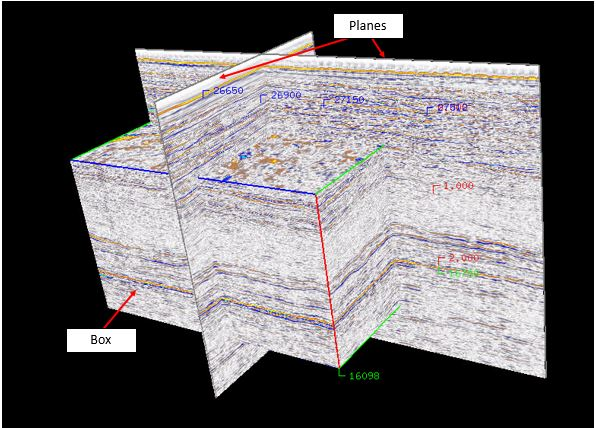
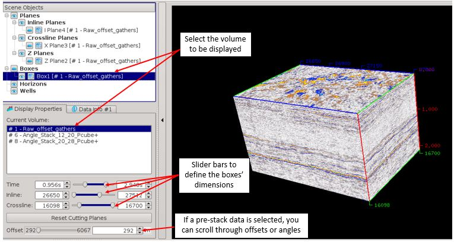
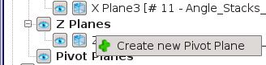
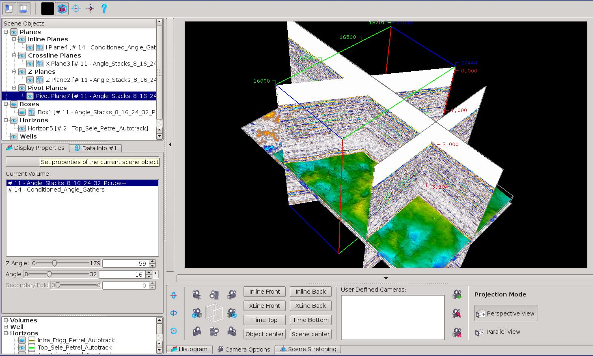

# Planes and Boxes

There are two main display modes in the 3D viewer: PLanes and Boxes. Planes allow to display one inline/crossline/timeslice, while boxes display the full volume.

  
_Scene objects in the 3D viewer: planes and Boxes_

As for planes, you can select different seismic volumes, set the histogram/transparency and colour palette. Planes and boxes can be displayed simultaneously.

Once the boxes selected in the Scene Object panel, the shape in term of inline/crossline/time can be selected using slider bars.

  
_Boxes' slider bars_

Pivot planes can be added to the display, rotated, and scrolled up and down the volumes.

To add a pivot plane, right click on the pivot plane and select the volume to display

Pivot planes can be rotated either using the mouse \(M+LMB\) or the slider bar one the left.  
To move the selected pivot planes, currently only the mouse can be used to do so \(shift+ scroll wheel button\). The pivot plane will then move up and down.  
The keyboard shortcut to select the pivot plane is P.

