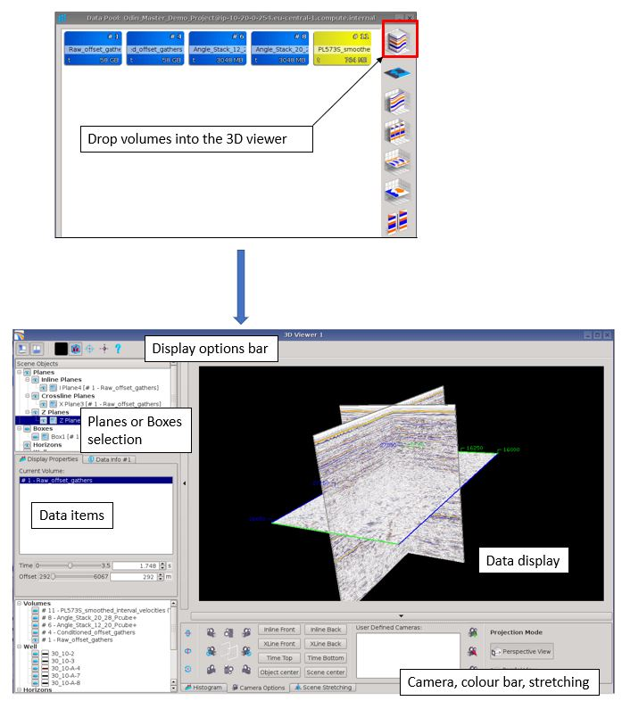
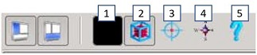
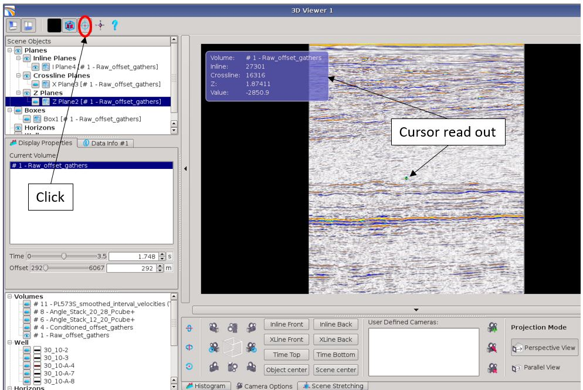
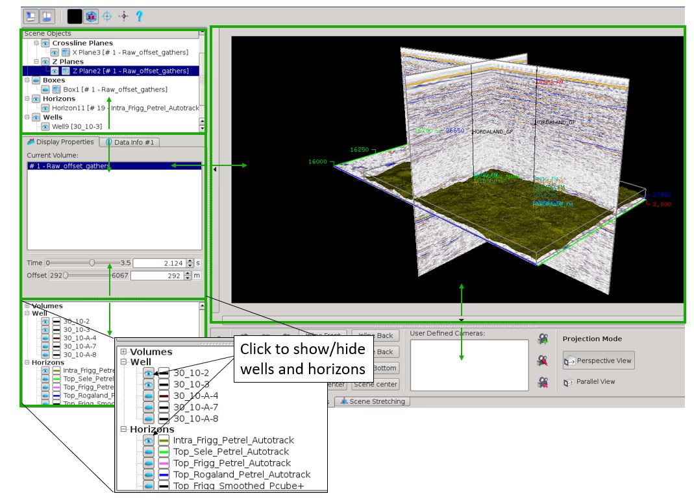
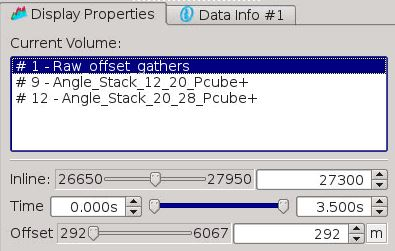
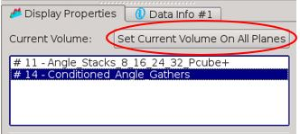
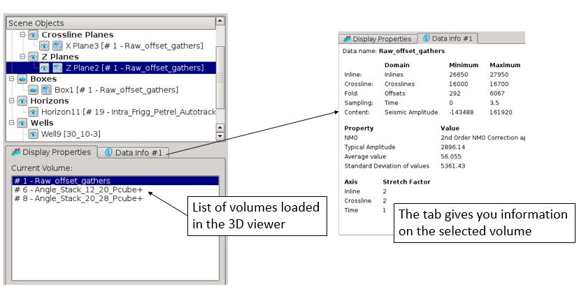
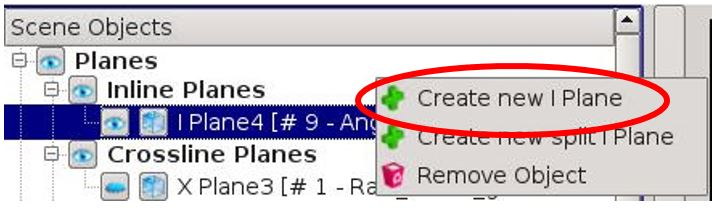
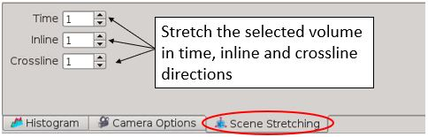

# Load and Display Data

Data are selected by drag and drop from the Data Pool. Drop data into the new 3D viewer icon. The viewer consists of 4 fields; Data display, Display options bar, Data items and the Camera & Color bar.

  
_3D viewer_

In the Data display window the items can be rotated using MB1, zoomed using MB2 \(can also scroll the mouse wheel\) and MB3 for pan.

From the Display options bar you can \(1\) change the background colour, \(2\) activate a bounding box that shows inline/crossline/time axis, \(3\) enable cursor read out mode to read out information from any position, and \(4\) show/hide the North arrow, \(5\) show/hide the keyboard shortcuts.

_Display option bar_

_Cursor read out_

In the Data items field, seismic volumes, horizons and well can be managed. Click on the eye icon to hide or unhide data. All windows inside the 3D viewer can be adjusted or hidden by dragging the border lines vertically or horizontally.

_Adjust window size and activate data_

If a second volume is dropped into the viewer, it won’t be seen on any of the panels, but will now appear as a volume option, along with the original volume, in all object properties.

  
_3 volumes loaded, offset gathers and two angle stacks \(see 3D viewer, multi volume examples below\)_

You can select to display the new volume only on one plane \(you select the volume, then the plane you want to display\), or you can display the new volume on all planes using the button as below:

You can move from one plane to another by simple keyboard shortcuts.  
By typing i, the inline plane will be highlighted.  
By typing c, the cross-line will be highlighted, t for time-slices and p for pivot planes.

Interactive selection can be done as well by using S+LMB, and then click on the planes you want to highlight.

If you have loaded several volumes into the viewer, they will appear in the "Display Properties" tab. You can access information of the selected volume by clicking on the "Data Info" tab. You will see inlines, crosslines, time, ..., ranges and stretch display factors.

_Loaded volume list and properties_

You can select the volume to display by highlighting the plane you want to modify, then by clicking on the desired volume in the display properties window. The change will be done only for the selected plane/box. That means you can display different seismic in each planes \(inline, crosslines or timeslices\).

You can add or remove a plane by using the RMB &lt;crew new I Plane&gt; or &lt;Remove object&gt;.

  
_GUI to add a new plane in the 3D viewer._

Each volume can have its own unique histogram, opacity and colour table, set by using the histogram tab located at the base of the viewer.

Each volume can be stretch in the 3 direction using the dedicated tab located at the bottom of the viewer. Stepsize of the stretch parameters is 0.1. It is possible  to use values less than 1. 

  
_Stretch seismic_

