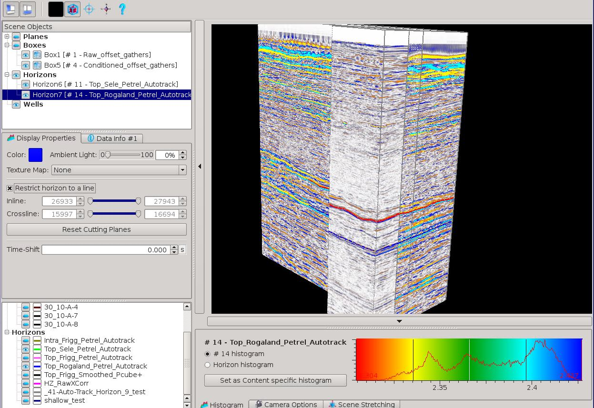
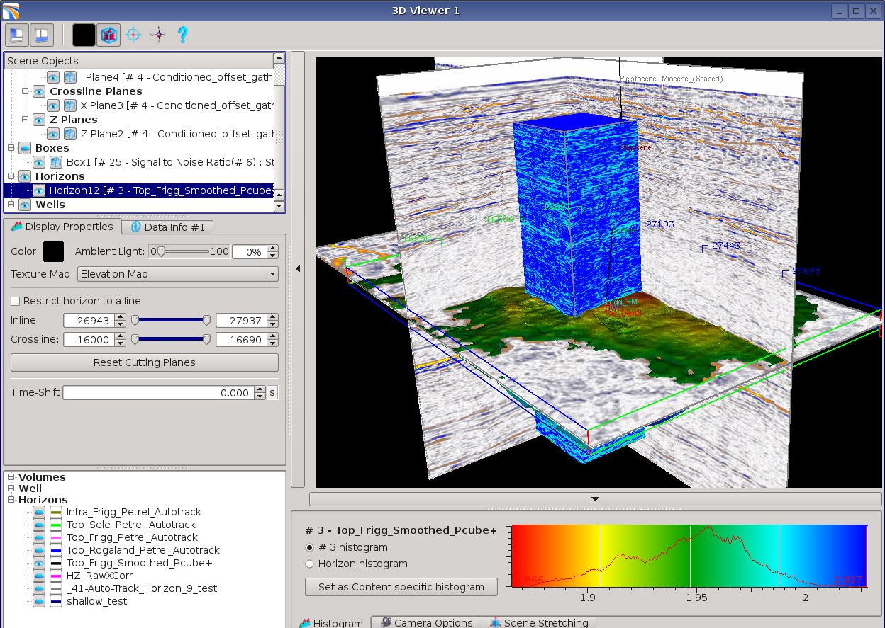
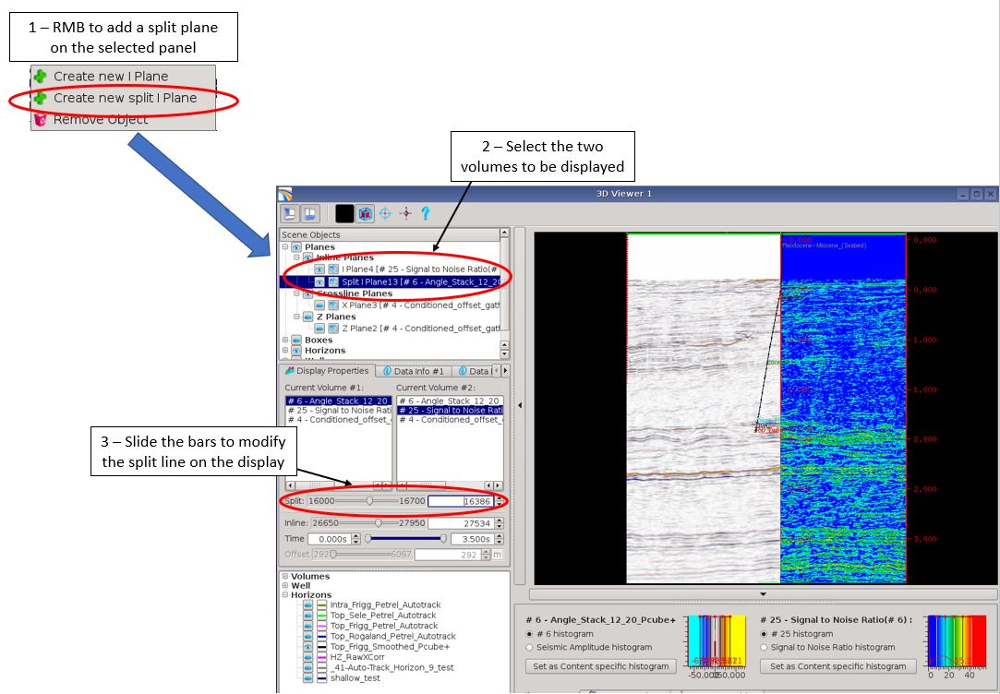

# Multi volumes display

Pre-Stack Pro 3D viewer allows multi volume displays. Each displayed volumes can have different ranges, can be different types and can be displayed with a specific histogram.

The first example has two pre-stack gather volumes, with different inline/crossline dimensions, each in their own box, being compared by sliding one across the other. The raw data is covered by the conditioned data which is showing on the left of the display. The data for angle 25 is being compared.

_Two overlapping pre-stack seismic boxes, with two horizons displayed on the conditioned and one on the raw data – The inline slider moves the conditioned over the raw seismic like drawing a curtain_

The second example has two seismic volumes, with different inline/crossline/offset/angle dimensions, with one horizon overlain. The first volume is conditioned offset gathers displayed as planes with inline/crossline/timeslice panels, the second is the Signal to Noise Ratio volume displayed as a box. Each seismic volume has its own histogram set and the S/N box has been reduced to just around the well location. The result is a good 3D view for showing the different seismic and QC within the same viewer as you can image similar displays with Acoustic Impedance cube from PCube+ inversion tests.

_One pre-stack gather, one stack and one horizon displayed with custom histograms_

The last example is the split plane QC available in the 3D viewer planes displays.

This split display allows to compare two volumes by modifying the split line and therefore better check the correlation between an attribute and the seismic for instance, or to compare seismic volumes with different conditioning.

_Split plane comparator in the 3D viewer_

