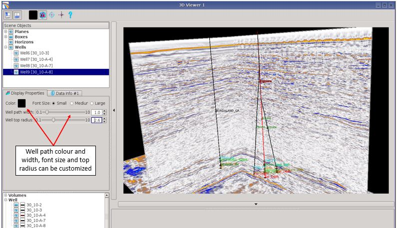
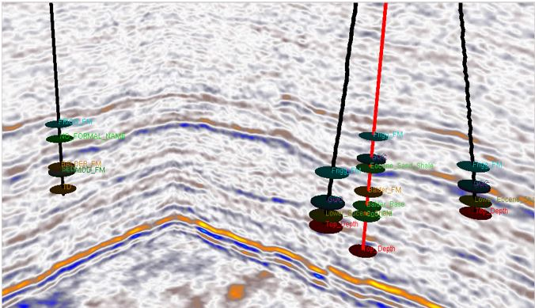

# Wells display

Wells can be displayed in the 3D viewer, the well path and the tops will be visible \(no well logs currently\).

Display settings can be customized: well patch colour and width, size font \(small/medium/large\) and well top radius.

_Wells display in the 3D viewer_

  
_Well tops_

