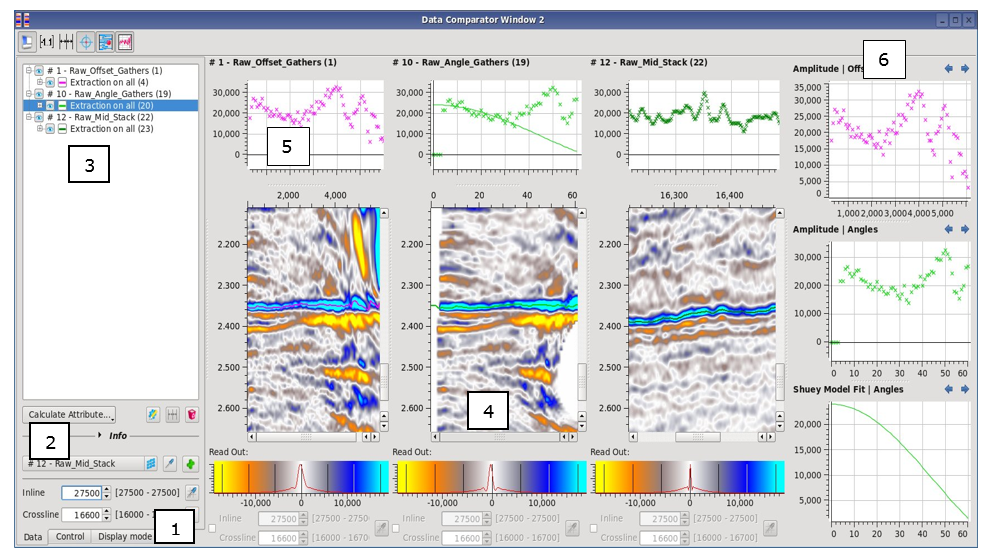
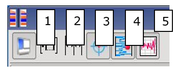

# 2D Data Comparator

This tool allows the visual comparison of your data in an interactive manner and the extraction of amplitude curves, at chosen times or existing horizons, for QC purposes. The user can display prestack data at a certain inline and crossline and stacked data in either the IL or XL direction.

This tool can be found in: **Viewer** → **Data Comparator...** It is possible to open several volumes at once by selecting them in the Data Pool, holding the _Ctrl_ tab, and using the Right Mouse button to click on _Show selected volumes in a Data Comparator._

_Several Data displayed in the Data Comparator_

When opening a volume in the Data Comparator we can see 3 tabs, swapping between Data/Control/Display Mode panels and 5 sections:

Section 1, 2 and 3 are visible in the **Data panel**. You will find there the **Data item field**, and this is where you can select volumes and obtain information about their type and values. Data are displayed in section 4 in a traditional **2D viewer**. Section 5 is a graph where a **read-out plot**, from the data displayed in the corresponding 2D view below, is plotted. You can disable the read-out plot independently for each panel by doing a right click in section 4 and un-ticking the option. Section 6 is the **plot panel** which summarizes all visible plots by type.

**Tool Bar**

1. Normalize all plot
2. Set the width of all panels
3. Turn on/off the read out plot for all panels
4. Turn on/off the marker values for all panels
5. Open/close the plot panel

