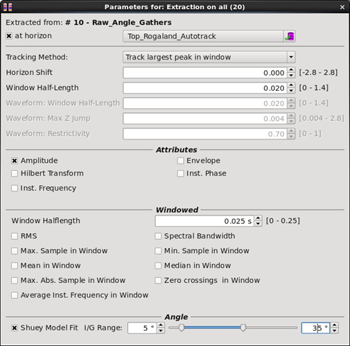
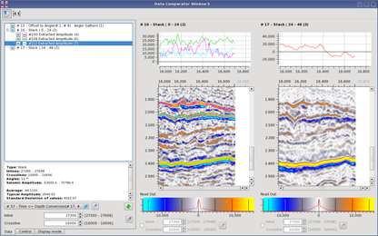
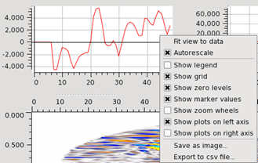

# Attributes extraction

## **Extract Attributes:** 

right mouse click in a viewer and select Extract Attributes… A window for parameter selection will pop-up.

_Parameters window for amplitude extraction_

You have the choice between several **Tracking Methods**.

* Window Center: you only need to specify the Window Center, extraction will be performed horizontally
* OR
* At Horizon: the extraction will be performed following an horizon time
* Snapping: you can choose to snap your extraction curve to the maximum positive, minimum negative or the maximum absolute within a given window. Parameters that need to be defined are the Window Center and the Window Half-Length.
* Tracking: track the largest peak or the largest trough within a window. You need to provide the same parameters as for the snapping.
* Waveform tracking: this option requires additional parameters for the tracking. The user has to specify the Waveform window half length, the Waveform max Z jump and the Waveform Restrictivity.

The extraction will be performed on the fly without the user needing to click on any calculate button.

If the gathers are in the angle domain, you can perform a Shuey model fit, which will be computed using a user defined angle range.

## **Extract attributes on all panels:**

This feature works in the same way with the difference that it will extract amplitudes on all the panels opened in the data comparator that contain volumes with similar vertical domain \(e.g. time\). The extraction will work with any horizontal domain \(offset, velocity…\) so that it is possible to extract amplitudes on a time gather and a time RMS velocity in one click.

If you add one or more new panels, after doing an attribute extraction on all panels, it will be automatically applied to the new panels.

**Graph window:** Extracted amplitude curves will all appear in the corresponding graph above, of section 5. You can change the color settings or remove a specific plot from the Data panel. It is possible to disable the read-out curve for better readability with a right mouse click in the viewer.

_Extracted amplitude curves in the Data Comparator_

**Tip**: Curves are extracted independently for each viewer, however if you want to plot curves extracted from different viewers in the same graph you can do it by a drag and drop from the Data panel to the desired graph.

_Right mouse click on the graph_

From a right mouse click in the graph you can adjust the axis automatically to fit the currently displayed curves, by clicking on Fit to view data. The Autorescale option will automatically fit your axis to the current read-out curve. To normalize your plots, click on icon on the top left corner of the Data comparator.

_Right mouse click on the graph’s axis_

From a right mouse click on the axis you can **Add a marker** of constant value into the graph.

_Marker of constant value called Reference plotted on a graph_

**Plot panel:** all computed plots will be visible, grouped by attribute types on separate plots. The arrows icon flips through the different types.

_Plot panel populated with three different types of plots_.

