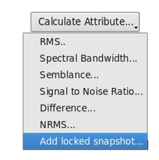
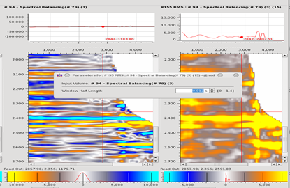

# Calculate Attributes

_Calculate attributes inside the data comparator_

The data comparator enables you to generate a set of on-the-fly attributes to help you QC your processing flow. These attributes are also all available outside of the comparator. They can be divided into two categories:

Attributes taking one input volume:

* [RMS](../../algorithm_documentation/readme.2/normalized_rms.md): computes the [Root Mean Square](../../algorithm_documentation/readme.2/moving_window_statistics.md) amplitude within a vertical sliding window.
* [Spectral Bandwidth](../../algorithm_documentation/readme.2/moving_window_statistics.md): Gives an indication of the resolution of the wavelet using a vertical moving window calculation.
* [Semblance](../../algorithm_documentation/readme.2/moving_window_statistics.md): Measures the horizontal coherency of a signal inside a stencil.
* [Signal to Noise Ratio](../../algorithm_documentation/readme.2/signal_to_noise_ratio.md): Calculates the relative signal to noise energy inside a stencil.
* Add locked snapshot: This creates a fixed copy of the panel, which will not update when processing parameters are changed.

Attributes taking two input volumes:

* [Difference](../../algorithm_documentation/readme.2/normalized_rms.md) : Compute the difference between the two selected volumes.
* [NRMS](../../algorithm_documentation/readme.2/normalized_rms.md): Computes the normalized root mean square difference between two volumes.

To compute an attribute, first select a volume by simple click in the **Data panel** \(a volume is selected when its name is white text in blue\). Then choose the wanted attribute in the list. The newly computed volume will be displayed in a panel at the right-hand side of the data comparator. In addition, a window will pop-up, giving you the possibility to dynamically change the parameters for the calculation. This **parameters window** can be accessed at any time by double clicking on the corresponding volume name in the Data section.

_RMS attribute computed on a gather and its corresponding parameters window_

For the case where the attribute takes two volumes as input, the first volume will be the one selected in the Data section and the second one should be chosen in the parameter window pop-up.

