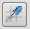
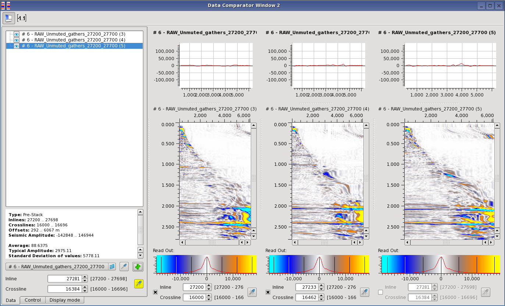
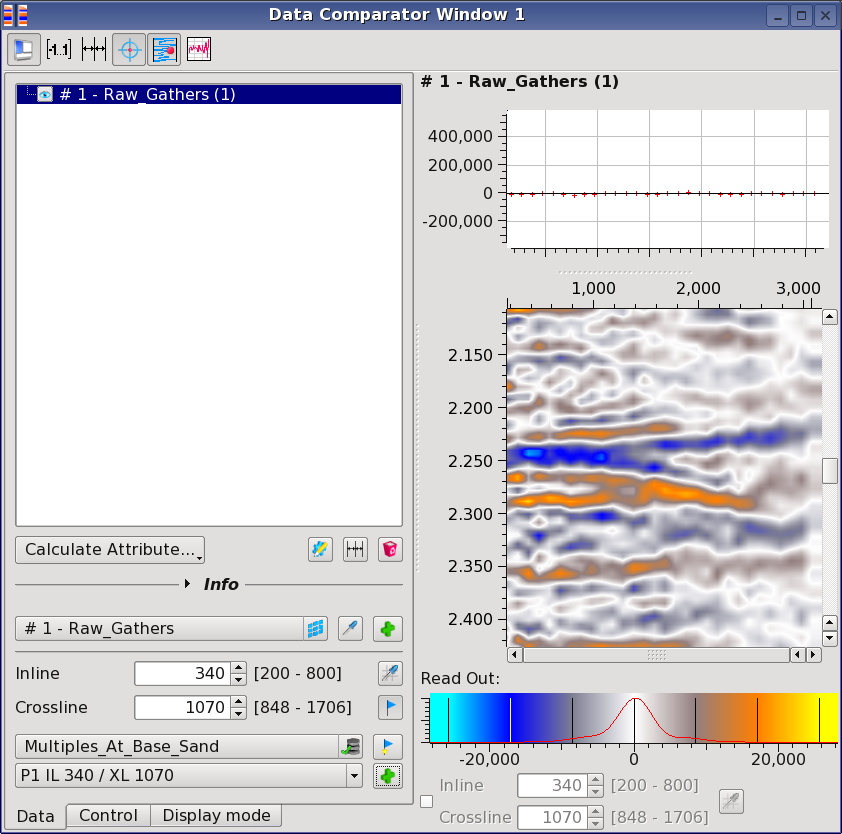

# Data selection

Data selection is done in section 1 of the **Data panel.** You can do the selection by clicking on the _selection menu_ tab or by picking a volume from the Data Pool using the probe  next to it. Click on  to display its content. Inline and crossline numbers are either changed manually or picked from an independent 2D viewer using the second probe  \(also will show with a cross the current location in the Map Viewer if linked to one\). By default the position of all the viewers inside the Data Comparator is synchronized. To look at your data at a different position in each viewer you need to tick the **Inline/Crossline** sub tab in section 4. This has the effect to disable the synchronization of the inline and crossline numbers between the different viewers.

_Three Gathers from the same data set with different inline/crossline position \(Note: the 1st and 2nd gather views have sync of inline/crossline disabled\)_

**Point sets selection:** Once you have identified locations of interest in your data \(e.g on a map or a stack\) you can mark them using locations of interest. Point sets selection enables you to switch easily \(in terms of IL/XL position\) between those locations in the data comparator. Click on the icon  located in the bottom left of the comparator to select a set of points of interest. You have access to the list of all locations contained in the set.  _Point sets locations in the data comparator_

Selecting different locations will automatically jump to the \(closest\) position on all panels opened in the data comparator. If the closest selection is exactly the same as the one defined in the Locations of Interest object, the inline and crossline field will have a green background. You can de-activate the automatic switching of one panel by making its position independent using the Inline/Crossline box located below it.

The current location visible in the panels can be added to the current Locations of Interest object by clicking on the  icon.

