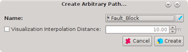
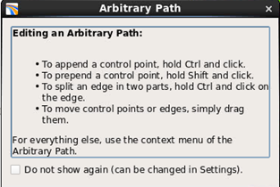
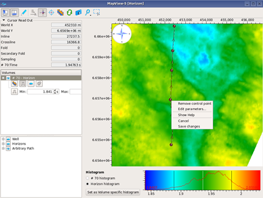
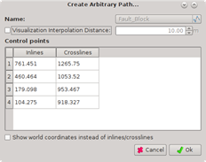

# Arbitrary lines

To optimize seismic visualization of geological structures, the arbitrary line option is very useful. The lines are generated by clicking on the map, and can be displayed in both the Gather Viewer and the Stack Viewer.

If gathers are displayed, the position used are the nearest gathers to the arbitrary line. If a stack section is displayed, traces are interpolated at positions exactly along the line using a bilinear scheme. The positions of the interpolated traces are automatically computed in a way that the spacing is as close as possible of the data. The map viewer will show the position of the interpolated trace when synchronized with a Stack viewer containing an arbitrary line section.

To generate a line, right click inside the map window and select **Create Arbitrary Path**. A dialogue box opens where you can write a name for the line and select an option to overwrite the interpolation distance.

When this is done, press **Create** and a message box will appear. This contains instructions of how to draw and edit the line by points and edges.

Click the X in the upper right corner to close this window. Start making the line by adding points.

The lines become available in the data selection window \(under **Arbitrary Path**, lower left side in the Map Viewer\). You can turn them on and off by clicking on the eye. As with wells and horizons, the colors can be changed by right clicking on the line name and selecting a new color.

You can right click on your line at any time to edit its parameters. This will also give you the opportunity to change inline/crossline \(or world-x and world-y\) positions of the points from a table. In this way, you can reproduce arbitrary lines that were made in another tool.

