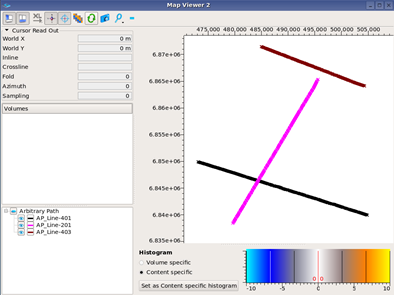

# Display 2D Lines

2D lines can be displayed in the map viewer. The arbitrary path representation of these 2D lines are available for selection.

_The arbitrary path of 2D lines displayed in the Map Viewer._

