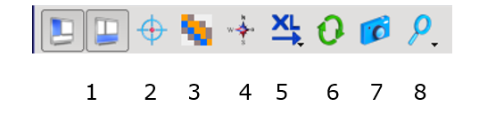
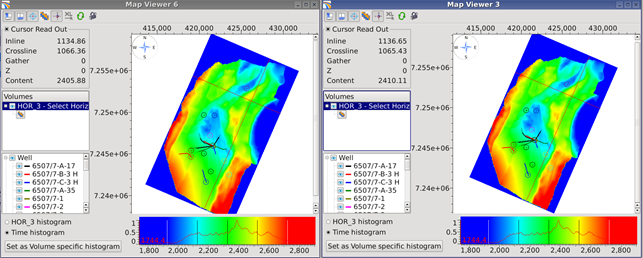

# Map viewer tool bar

All map windows have a top menu bar that contain practical functionalities

1. Show/hide windows
2. Crosshairs for position read out
3. Image interpolation on/off
4. Rotate map to north
5. Selection of X-axis \(inline/crossline\)
6. Synchronise two viewers
7. Screen capture
8. Pre-defined zoom level

_Two map viewers are synchronized, with rotation to north and with cursor tracking \(with crosshairs enabled\)_

