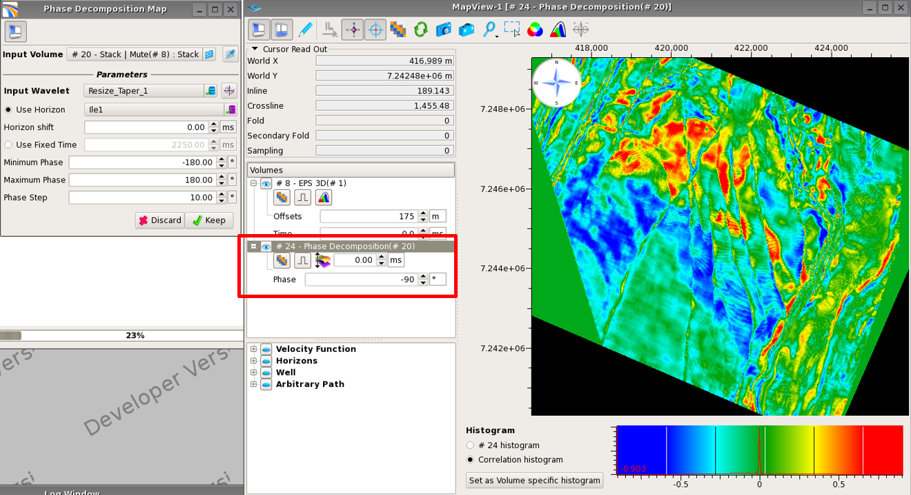

# Phase decomposition

For details about the algorithm, see the [phase decomposition](../../algorithm_documentation/readme.2/phase-decomposition.md) section.

Phase decomposition can be performed on the fly from the Map Viewer, using stacked or pre-stack volumes as input. 

Phase Decomposition is open by clocking on the icon  

Once open, the map viewer automatically become a preview showing the result of the algorithm applied on the selected input volume. The results are either on a constant time slice or along a user chosen horizon. The displayed phase is controlled via a selector in the Map Viewer scene tree.

The time slice or map can be kept in the Data Pool by pressing Keep.

