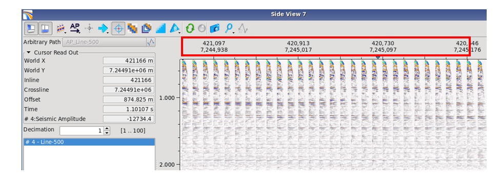

# Displaying gathers from 2D lines

Gathers from 2D lines are displayed in the same way as gathers from 3D data. But the World X and Y coordinates are displayed instead of inline/crossline values.

In version 4.6, in the Cursor Read Out window the Inline/Crossline parameters are present showing the World X and Y coordinates. In a future release these will be changed to line number and CDP number._Displaying gathers from a 2D line in the 2D Gather Viewer._

