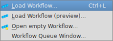

# Workflow

Pre-Stack Pro provides powerful tools to improve data quality prior to stacking. Pre-stack dataset sizes range from 100's to 1000's of GB and exceed the shared memory capacity of all but the largest clusters.

In Pre-Stack Pro you can work with a selection of your dataset interactively, find a suitable set of processing steps, save it as a workflow and finally apply this workflow to the whole dataset in a batch mode.

A workflow is a recipe; it contains algorithms and all of their parameters to create one or more volumes. A workflow does not save or create volumes until it is executed. A workflow is a file that can be saved anywhere on the disk with the extension \*.wml.

The workflow menu:

* Load existing workflow to run or edit it
* Show the preview of a workflow and then load this workflow to run or edit it
* Open an empty workflow window, to edit it by adding algorithms
* Manage the workflow queue

_Workflow menu in Pre-Stack Pro_

