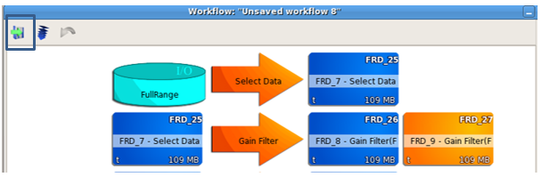
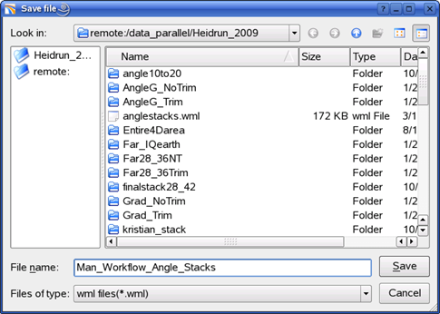

# Save a workflow

The save workflow option is available on the top section of the workflow window.

  
_Save workflow option_

The **Save file** window will open and ask for a name of the workflow and a storage location. The file will get a .wml suffix automatically.

_Save workflow window as a .wml file_

By default, the workflow will be saved inside the project directory. However, this workflow can be used in any projects if needed.

For non-project specific workflow, it is good practice to save them in a workflow folder independent of any projects.

