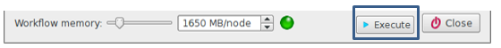
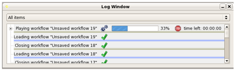
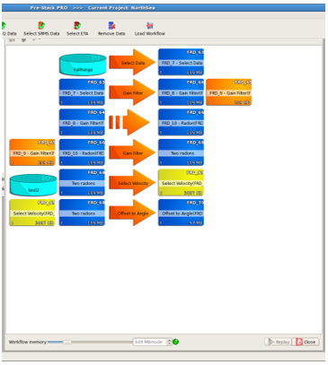
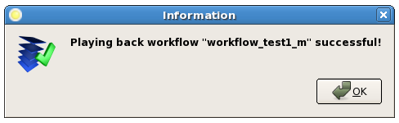
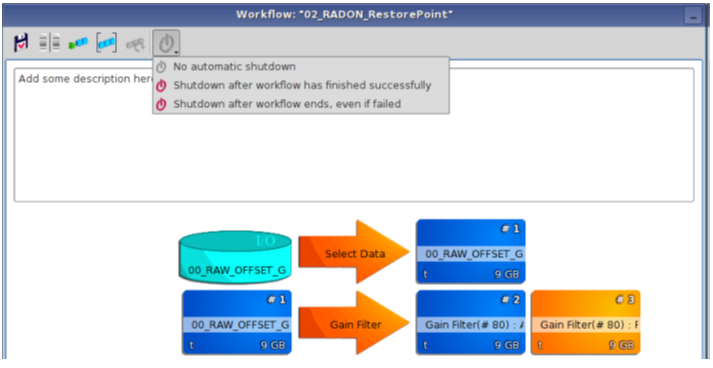

# Execution

Once the workflow is loaded in Pre-Stack Pro, it can be executed. Press the **Execute** button in section 4 of the window.

_Execute button_

If any modification has been done on the data selection, algorithm parameter or processing sequences, it will be used even if the modification has not been saved.

The progress of the run can be followed in the log window as well as in the workflow itself.

In the log window, quantitative information is given on the estimated run time.

_Log window_

In the workflow window, an animation on the process arrow visually indicates which process is currently running. In the workflow window below, the $$3^{rd}$$ process is active.

_Visual indication of the current process being run_

Once the workflow has run, a successful completion message will appear:

_Successful play back message_

The visualization of the data can be done in various ways:

* Any data from the workflow can be dragged and dropped into any of the 4 visualization windows
* Volumes can be dragged from the workflow window into the Data Pool to create a read-only copy
* By pressing the close button \(section 3 of the workflow window\) the volumes can be moved to the data pool.
* By pressing on the ad hoc icon in the tool bar, all volumes can be opened in a Data Comparator window.

**If you are running Pre-Stack Pro in the cloud:** an option to shut down the software and pause your instance once the workflow is finished is present.

 _Option to shut down the software once the workflow is completed_

