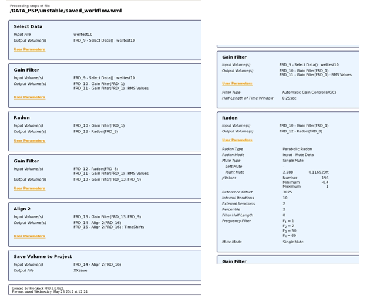

# Load a workflow with Preview

This option allows you to have an overview of the workflow without loading it. A list of all the steps done by this workflow is available.

To load a workflow with preview, go to:

**Workflow** → **Load Workflow with Preview**

Go to the location where the workflow \(.wml\) file resides, select it and press **Open**.

The Workflow preview is then available in workflow/load workflow with preview. This option shows the processing steps in HTML format.

_Workflow preview and user parameters_

The parameters used by each process can be checked by pressing the “user parameters” options. The workflow can then be loaded or closed using the bottom options.

This preview is only available for workflows created in the 3.0 version or older. However, to make the preview available for existing workflows, created in previous versions, simply load a workflow file created in a previous version, and save it again.

