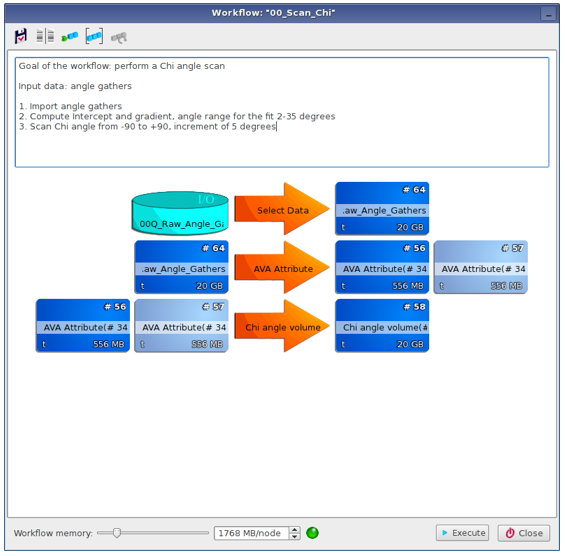
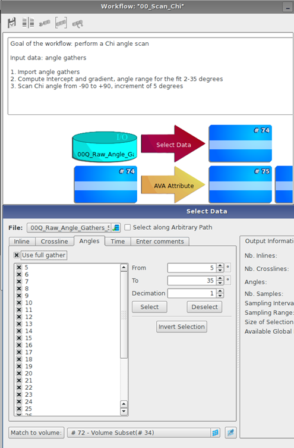
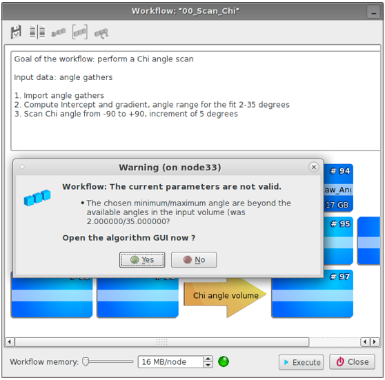
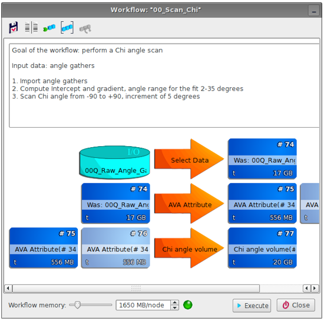

# Load invalid workflow

A workflow can be loaded an invalid state if there are inconsistencies in the parameters or choice of input volumes, it stays. The workflow will stay open but cannot be run until it is fixed. An error message is displayed to help you solve the issue by editing the workflow.

**Practical example:**

This workflow inputs angle gathers and scans chi angle range from -90 to +90 degrees. The intercept and gradient are computed using the range of angles of incidence of 0 to 35 degrees.

When loading this workflow, if we select a dataset whose angle range is lower than 0 to 35 degrees, the workflow will be invalid as the data geometry does not match with the parameters. This dataset is from 5 to 35 degrees.

Once the user presses the Select, the workflow manager catches the invalidity and issues a warning.

Opening the user interface for the AVA attributes algorithm, the user can edit the angle range used for the computation, reducing the minimum angle used to the same as the input data.

The workflow is now ready to be executed.

