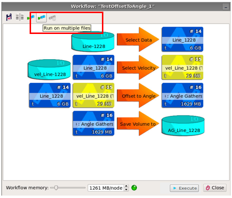
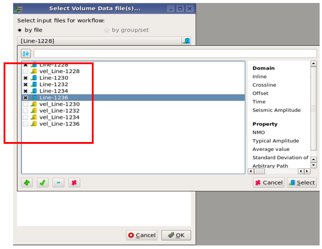
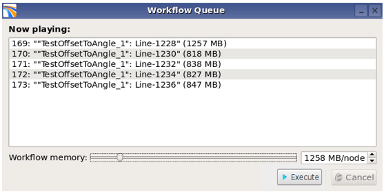
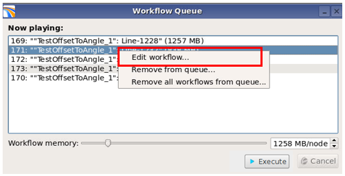
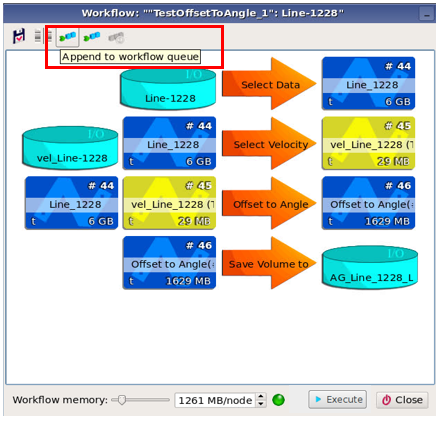

# Workflows for multiple files

A queue of workflows for multiple files can easily be set up. This is particularly useful for 2D surveys, when the user must run similar workflows on many 2D lines. This section will refer to 2D lines, but this feature can also be applied to multiple 3D volumes.

An existing workflow can be used, or a new a workflow can be created, as described in section 7.2 . This workflow must be loaded for one of the 2D lines. Then the button “Run on multiple files” is selected.

  
_Selecting «Run on multiple files»_

A “Select Data Volume file\(s\)” window appears where the user must select which lines to include. The user should chose velocity volumes together with the seismic data volumes.

When all relevant files have been selected, click OK.

  
_Selecting seismic data and velocity volumes_

A list of the workflows for the selected lines will then appear in the Workflow Queue window.

  
_“Workflow Queue” window with list of workflows_

The parameters of a specific workflow in the Workflow Queue can be edited by right clicking on that workflow in the list and then selecting Edit workflow.

  
_Open a workflow for editing by right clicking the workflow and select Edit workflow_

After the workflow has been edited, it must be appended to the workflow queue.

 _Appending the workflow to the workflow queue after the editing of the workflow is finished_

Finally, to start running the workflows, the Execute button in the Workflow Queue window must be selected.

