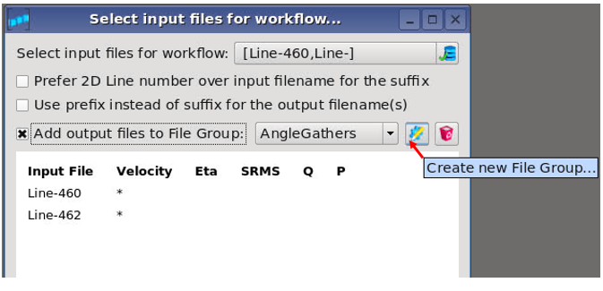
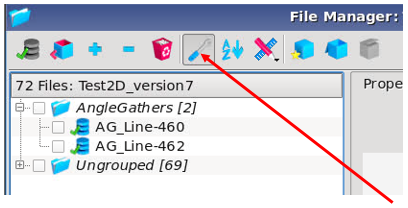

# Adding output files from workflows to File Groups

Running workflows on multiple lines will generate many output files. It’s possible to “Add the output files to File Groups” to get a better overview of these files.

In the “Select input files for workflow”, the output files can be added to existing File Groups by toggling on “Add output files to File Group”. New File Groups can be created by clicking on the “Create new File Group” button.

  
_Creating new File Group, and adding output files to File Group_

After running a queue of workflows, the user can click on the icon “Show in Grouped Mode” in the File Manager in order to see the saved output files. They are stored in the defined File Groups.

_Output files in defined File Groups, in the File Manager. Choose “Show in Grouped Mode”_

